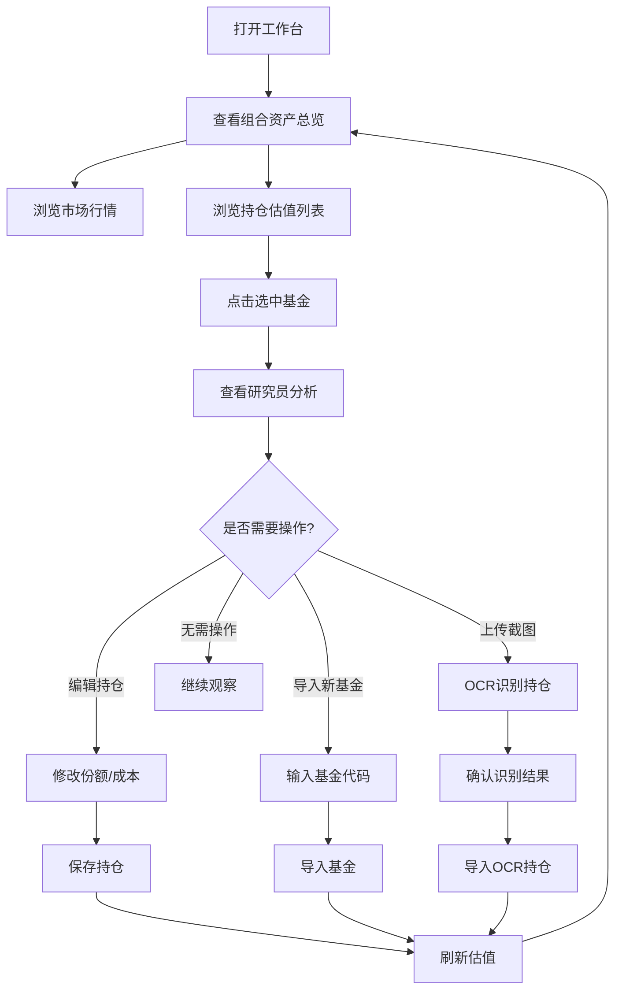

## 1. 产品概述

私人基金工作台——面向个人投资者的基金持仓分析与趋势研判仪表盘。
- 核心解决：持仓结构是否合理、今日行情对持仓的影响、哪些基金需要重点观察、仓位与风险预警
- 目标用户：有 5-20 只基金持仓的个人投资者，需要每日跟踪估值、盈亏和研究员建议

## 2. 核心功能

### 2.1 用户角色

| 角色 | 注册方式 | 核心权限 |
|------|----------|----------|
| 个人投资者 | 本地部署 | 查看持仓、导入基金、编辑持仓、刷新估值、查看研究员分析、OCR导入、每日复盘 |

### 2.2 功能模块

1. **仪表盘首页**：组合资产总览、今日预估收益、累计盈亏、权益仓位、持仓基金数量、市场指数行情条
2. **持仓估值列表**：基金列表搜索/排序、编辑份额与成本、保存持仓、涨跌色标
3. **研究员分析面板**：选中基金的 AI 研究员结论、板块暴露、重仓股、快讯公告、数据源状态
4. **操作命令栏**：导入基金、刷新估值、上传持仓截图

### 2.3 页面详情

| 页面名称 | 模块名称 | 功能描述 |
|----------|----------|----------|
| 仪表盘首页 | Hero 资产区 | 展示组合总资产金额、今日估算收益与累计盈亏、仓位风险标签、市场上涨指数统计 |
| 仪表盘首页 | 指标卡片区 | 四个核心指标：今日预估收益、累计盈亏、权益仓位、持仓基金数 |
| 仪表盘首页 | 命令栏 | 输入基金代码导入、刷新估值、上传截图 OCR 导入 |
| 仪表盘首页 | 市场行情条 | 8 个主要指数实时值与涨跌幅 |
| 持仓估值列表 | 列表头 | 搜索过滤、编辑持仓切换、保存按钮、排序切换 |
| 持仓估值列表 | 基金行 | 基金名/代码/标签、估值/涨跌幅、份额/成本/市值/今日盈亏/累计盈亏 |
| 研究员面板 | 选中基金卡 | 基金名、代码、估值时间、大字号涨跌幅 |
| 研究员面板 | 研究员结论 | 多个 AI 研究员卡片，含偏强/偏弱/关注标签、结论文字、证据标签 |
| 研究员面板 | 板块暴露 | 行业权重与涨跌 |
| 研究员面板 | 重仓股 | 股票名+涨跌幅标签列表 |
| 研究员面板 | 快讯与公告 | 最新快讯标题+公告链接 |
| 研究员面板 | 数据源 | 各数据源健康状态 |

## 3. 核心流程

用户打开工作台 → 查看组合资产与涨跌 → 选择基金查看研究员分析 → 根据分析结论决定操作 → 编辑持仓份额/成本 → 保存 → 刷新估值

## 4. 用户界面设计

### 4.1 设计风格

**风格方向：深色金融终端 (Dark Terminal)**

- 整体深色背景（近乎纯黑），营造专业金融终端氛围
- 主色调：深蓝黑 `#0a0e1a` → `#111827` 渐变
- 强调色：青蓝 `#06b6d4`（品牌色/交互元素），暖琥珀 `#f59e0b`（关注/警示）
- 涨色：`#ef4444` 红色涨，`#22c55e` 绿色跌（A股习惯）
- 卡片：半透明深色磨砂玻璃 `rgba(15, 23, 42, 0.6)` + `backdrop-filter: blur`
- 按钮：圆角 8-10px，品牌色实心主按钮 + 幽灵边框次按钮
- 字体：`Geist`（标题/数字）+ `Noto Sans SC`（中文正文），等宽数字字体用于金额
- 布局：双栏布局（左 2/3 持仓列表 + 右 1/3 研究员面板），顶部仪表盘
- 图标：lucide-react 线性图标，1.5px 描边
- 动效：卡片入场淡入上移、选中基金高亮发光、数据刷新脉冲动画、hover 微上浮+阴影加深

### 4.2 页面设计概述

| 页面名称 | 模块名称 | UI 元素 |
|----------|----------|---------|
| 仪表盘首页 | Hero 资产区 | 深色渐变背景大卡片，左对齐大字号金额，右侧状态胶囊标签，微弱网格线纹理背景 |
| 仪表盘首页 | 指标卡片区 | 2x2 网格深色卡片，图标+标题+大字号数值，涨跌色标识 |
| 仪表盘首页 | 命令栏 | 横向排列，深色输入框+品牌色主按钮+幽灵次按钮 |
| 仪表盘首页 | 市场行情条 | 4x2 网格紧凑行条，左指数名+中数值+右涨跌幅色标 |
| 持仓估值列表 | 列表头 | 透明背景，搜索框+操作按钮组 |
| 持仓估值列表 | 表头行 | 深色半透明背景，可点击排序列头 |
| 持仓估值列表 | 基金行 | 深色行，hover 微亮，选中态左侧品牌色亮条+背景微亮，涨跌色数值 |
| 研究员面板 | 选中基金卡 | 渐变边框深色卡片，大字号涨跌幅 |
| 研究员面板 | 研究员卡片 | 深色卡片，左侧色条标识等级，结论文字+证据标签 |
| 研究员面板 | 板块/重仓股/快讯 | 折叠式深色小区块，紧凑排版 |

### 4.3 响应式设计

- 桌面优先（1440px+ 最佳体验）
- 1180px 以下：双栏变单栏，研究员面板堆到列表下方
- 760px 以下：指标卡片单列、命令栏竖排、行情条单列

### 4.4 3D 场景指引

不适用
