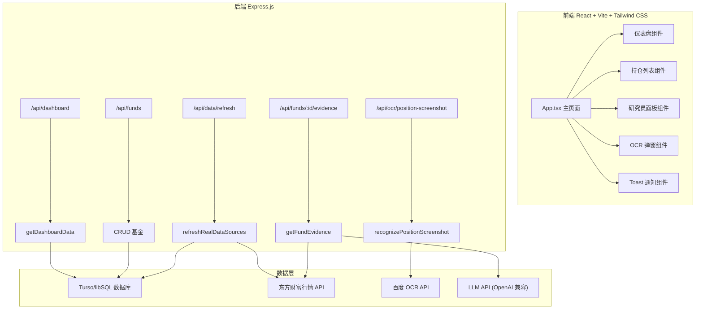

## 1. 架构设计



## 2. 技术说明

- 前端：React 19 + TypeScript + Tailwind CSS 3 + Vite 8
- 初始化工具：已有项目，不使用 vite-init
- 后端：Express 5 + multer（文件上传）
- 数据库：Turso/libSQL（已有）
- CSS 方案：从手写 CSS 迁移到 Tailwind CSS utility-first，删除 style.css
- 图标：lucide-react（已有）
- 状态管理：React useState（简单状态），不引入 zustand
- 动效：CSS transitions + keyframes（不引入 motion 库）

## 3. 路由定义

| 路由 | 用途 |
|------|------|
| / | 单页仪表盘，所有功能在同一页面 |

## 4. API 定义

已有 API 端点保持不变：

| 端点 | 方法 | 用途 |
|------|------|------|
| /api/dashboard | GET | 获取仪表盘全量数据 |
| /api/funds | POST | 新增基金 |
| /api/funds/:id | PUT | 更新基金持仓 |
| /api/funds/:id | DELETE | 删除基金 |
| /api/data/refresh | POST | 刷新行情数据 |
| /api/funds/:id/evidence | GET | 获取基金研究员分析 |
| /api/ocr/position-screenshot | POST | OCR 识别持仓截图 |
| /api/holdings/import-from-ocr | POST | 导入 OCR 持仓 |

### 前端数据类型

```typescript
type Fund = {
  id: string
  code: string
  name: string
  type: string
  cost: number
  nav: number
  shares: number
  estimateChange: number
  positionRatio: number
  tags: string[]
  estimateSource?: string
  estimateTime?: string
  estimateUpdatedAt?: string
}

type Market = {
  code: string
  name: string
  value: number
  change: number
  source: string
}

type DashboardData = {
  tradeDate: string
  funds: Fund[]
  markets: Market[]
}

type AgentInsight = {
  id: string
  title: string
  level: 'positive' | 'negative' | 'watch' | 'neutral'
  conclusion: string
  evidence: string[]
}

type Evidence = {
  agents?: AgentInsight[]
  exposure?: {
    sectors: { name: string; weight: number; avgChange: number }[]
    stocks: { code: string; name: string; changePercent: number }[]
  }
  fastNews?: { items: { id: string; title: string; summary: string; time: string }[] }
  announcements?: { items: { id: string; title: string; category: string; date: string; url: string }[] }
  sourceStatus?: { source: string; ok: boolean; count: number; message: string }[]
}
```

## 5. 服务器架构图

不涉及变更，保持现有 Express 单文件架构。

## 6. 数据模型

不涉及变更，保持现有数据库 schema。

### 6.1 迁移策略

本次改造仅涉及前端 UI 层：
1. 安装 Tailwind CSS + 配置
2. 重写 App.tsx，使用 Tailwind utility classes 替代所有手写 CSS
3. 删除 style.css
4. 保持所有 API 调用逻辑不变
5. 保持所有类型定义和业务逻辑不变
